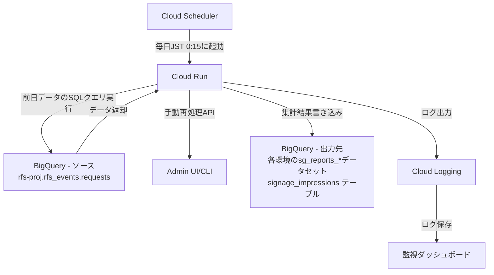
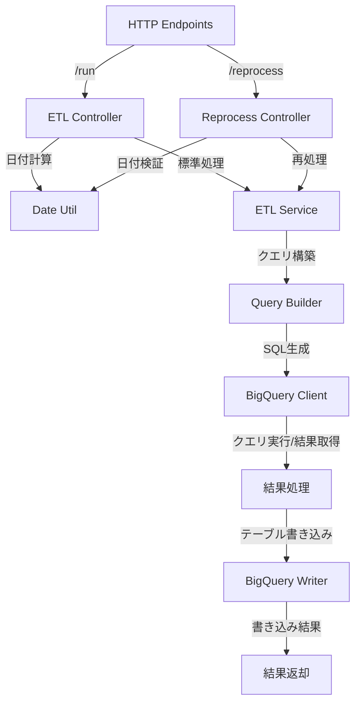
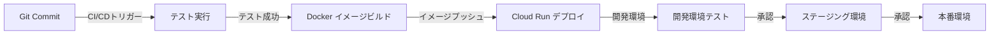

# BigQueryデータ集約システム - 実装計画

## システム概要

このシステムは、BigQuery上のデータを集約し、別のBigQueryテーブルに出力するETL処理を実装します。毎日JST 0:15に前日分のデータを対象として処理を行います。



## アーキテクチャと技術選定

- **言語とフレームワーク**: TypeScript + Express
- **インフラストラクチャ**: Google Cloud (Cloud Run, BigQuery, Cloud Scheduler)
- **モニタリング**: Cloud Logging, Cloud Monitoring
- **コンテナ化**: Docker

## データフロー詳細

1. **スケジュール起動**: Cloud Schedulerが毎日JST 0:15に起動
2. **前日データ特定**: 処理対象となる前日の日付を特定
3. **SQL実行**: 対象日のデータを集計するSQLクエリを実行
4. **データ変換**: クエリ結果をテーブル書き込み用に変換
5. **データロード**: 集計結果を各環境のBigQueryテーブルに書き込み
6. **ログ記録**: 処理結果とメタデータをCloud Loggingに記録

## テーブル設計

### 出力テーブル: `signage_impressions`

| カラム名 | データ型 | 説明 |
|---------|---------|------|
| timestamp_hourly | TIMESTAMP | 時間単位の集計タイムスタンプ |
| mediumId | INTEGER | メディアID |
| storeId | INTEGER | ストアID |
| device_id | STRING | デバイスID |
| programId | INTEGER | プログラムID |
| sequence | INTEGER | シーケンス |
| creativeId | INTEGER | クリエイティブID |
| deliveryId | INTEGER | デリバリーID |
| imp | INTEGER | インプレッション数 |
| cnt | INTEGER | カウント数 |

**テーブル設定**:
- パーティショニング: `timestamp_hourly` 列で日次パーティショニング
- クラスタリング: `mediumId`, `storeId`, `creativeId`
- 保持期間: 無期限（データは削除しない）

## 実装詳細

### Cloud Run サービス実装



#### ディレクトリ構造

```
services/
  cloud-run/
    imp-log-etl/
      src/
        index.ts                 # エントリーポイント
        app.ts                   # Expressアプリケーション
        controller/
          etl.controller.ts      # 標準ETL処理コントローラー
          reprocess.controller.ts # 再処理用コントローラー
        service/
          etl.service.ts         # ETLサービスロジック
        query/
          imp.query.ts           # インプレッションクエリビルダー
        repository/
          bigquery.repository.ts # BigQuery接続・実行処理
        config/
          environments.ts        # 環境別設定
        util/
          date.util.ts           # 日付操作ユーティリティ
          logger.ts              # ロギングユーティリティ
      test/                      # テストコード
      Dockerfile                 # Dockerファイル
      package.json               # パッケージ設定
      tsconfig.json              # TypeScript設定
```

### コア機能実装

#### 1. 日次ETL処理
- スケジューラーから起動され、前日のデータを処理
- 処理日付はJST基準で計算

```typescript
// etl.controller.ts (概略)
@Get('/run')
async runEtl(
  @Query('date') dateParam?: string,
): Promise<ETLResponse> {
  const targetDate = dateParam 
    ? new Date(dateParam) 
    : DateUtil.getYesterdayJST();
  
  return await this.etlService.process(targetDate);
}
```

#### 2. 手動再処理機能
- 特定の日付のデータを手動で再処理するためのエンドポイント
- 管理者権限で保護（Cloud Run IAM設定）

```typescript
// reprocess.controller.ts (概略)
@Post('/reprocess')
async reprocessDate(
  @Body() data: ReprocessRequest,
): Promise<ETLResponse> {
  if (!DateUtil.isValidDate(data.date)) {
    throw new BadRequestException('Invalid date format');
  }
  
  return await this.etlService.process(new Date(data.date));
}
```

#### 3. クエリビルダー
- 提供されたSQLクエリをテンプレートとして使用
- 日付パラメータを動的に設定

```typescript
// imp.query.ts (概略)
export function buildImpressionsQuery(targetDate: Date): string {
  const formattedDate = DateUtil.formatDate(targetDate, 'YYYY-MM-DD');
  
  return `
  DECLARE default_opening_time STRING DEFAULT "09:00";
  DECLARE default_closing_time STRING DEFAULT "21:00";
  
  SELECT
    FORMAT_TIMESTAMP('%Y-%m-%d %H:00:00', timestamp, 'Asia/Tokyo') AS timestamp_hourly,
    CAST(rfs_events.url_parse(httpRequest.requestUrl, 'mediumId') AS INT64) as mediumId,
    CAST(rfs_events.url_parse(httpRequest.requestUrl, 'storeId') AS INT64) as storeId,
    rfs_events.url_parse(httpRequest.requestUrl, 'device_id') as device_id,
    CAST(rfs_events.url_parse(httpRequest.requestUrl, 'programId') AS INT64) as programId,
    CAST(rfs_events.url_parse(httpRequest.requestUrl, 'sequence') AS INT64) as sequence,
    CAST(rfs_events.url_parse(httpRequest.requestUrl, 'creativeId') AS INT64) as creativeId,
    CAST(rfs_events.url_parse(httpRequest.requestUrl, 'deliveryId') AS INT64) as deliveryId,
    SUM(CASE WHEN FORMAT_TIMESTAMP('%H:%M', timestamp, 'Asia/Tokyo') >= COALESCE(NULLIF(signage.opening_time, ''), default_opening_time) 
          AND FORMAT_TIMESTAMP('%H:%M', timestamp, 'Asia/Tokyo') < COALESCE(NULLIF(signage.closing_time, ''), default_closing_time) 
          THEN 1 ELSE 0 END) as imp,
    COUNT(1) cnt
  FROM
    rfs_events.requests req
  LEFT JOIN 
    rfs_spreadsheet.signage signage 
  ON 
    rfs_events.url_parse(httpRequest.requestUrl, 'device_id') = signage.fully_device_id
  WHERE
    regexp_extract(httpRequest.requestUrl, '//[^/]+([^?#]+)') = '/tracking'
    AND rfs_events.url_parse(httpRequest.requestUrl, 'event') = 'complete'
    AND rfs_events.url_parse(httpRequest.requestUrl, 'send_ts') != ''
    AND TIMESTAMP_ADD(TIMESTAMP, INTERVAL 9 HOUR) BETWEEN "${formattedDate} 00:00:00" AND "${formattedDate} 23:59:59"
    AND rfs_events.url_parse(httpRequest.requestUrl, 'networkId') = '1'
  GROUP BY 
    timestamp_hourly, mediumId, storeId, device_id, programId, sequence, creativeId, deliveryId
  HAVING 
    imp > 0
  `;
}
```

## エラーハンドリング戦略

1. **エラー通知**: 
   - 処理失敗時のログ詳細を Cloud Logging に記録
   - エラー内容に応じたHTTPステータスコードを返却

2. **手動再処理**:
   - 自動リトライはなし
   - 失敗した日付データは管理者が `/reprocess` エンドポイントを使用して手動で再処理

3. **データ整合性保証**:
   - 再処理時は既存データを置き換え（MERGE操作）により、重複を防止

```typescript
// etl.service.ts (概略)
async process(date: Date): Promise<ETLResponse> {
  try {
    const query = this.queryBuilder.buildImpressionsQuery(date);
    const results = await this.bigQueryClient.executeQuery(query);
    
    // 既存データを削除
    await this.bigQueryWriter.deleteExistingData(this.getTableForEnvironment(), date);
    
    // 新データを挿入
    const rowCount = await this.bigQueryWriter.insertData(
      this.getTableForEnvironment(), 
      results
    );
    
    this.logger.info(`Successfully processed ${rowCount} rows for date ${date}`);
    return { success: true, processedDate: date, rowCount };
  } catch (error) {
    this.logger.error(`Failed to process data for date ${date}`, error);
    throw error;
  }
}
```

## Cloud Scheduler 設定

- スケジュール: 毎日JST 0:15 (cron: `15 0 * * *`)
- タイムゾーン: Asia/Tokyo
- ターゲット: Cloud Run HTTPエンドポイント (`/run`)
- 認証: サービスアカウント認証

```
gcloud scheduler jobs create http imp-log-etl-daily \
  --schedule="15 0 * * *" \
  --time-zone="Asia/Tokyo" \
  --uri="https://{SERVICE_URL}/run" \
  --http-method=GET \
  --oidc-service-account-email={SERVICE_ACCOUNT} \
  --oidc-token-audience="https://{SERVICE_URL}"
```

## 環境別設定

| 環境 | データセット | テーブル | 適用方法 |
|------|------------|---------|---------|
| 開発 | sg_reports_tmp | signage_impressions | 環境変数で設定 |
| ステージング | sg_reports_staging | signage_impressions | 環境変数で設定 |
| 本番 | sg_reports_production | signage_impressions | 環境変数で設定 |

## デプロイメントフロー



## テスト戦略

1. **ユニットテスト**:
   - クエリビルダー
   - 日付ユーティリティ関数
   - データ変換関数

2. **統合テスト**:
   - BigQueryクライアント
   - エンドポイント呼び出し

3. **E2Eテスト**:
   - 開発環境での完全なデータフロー
   - テストデータを使用した検証

## 運用計画

1. **モニタリング**:
   - Cloud Runのリクエスト成功率
   - 処理時間の測定
   - 処理データ量のトラッキング

2. **アラート設定**:
   - ETL処理失敗時のアラート
   - 処理時間が閾値を超えた場合のアラート

3. **運用ツール**:
   - 管理コマンド（または管理UI）で特定日付のデータ再処理を実行

## 実装ロードマップ

1. **フェーズ1**: 基本ETL処理実装
   - BigQueryクライアント構築
   - クエリビルダー実装
   - Cloud Run基本機能実装

2. **フェーズ2**: エラーハンドリング
   - 詳細なエラーログ
   - 再処理APIエンドポイント

3. **フェーズ3**: 環境分離設定
   - 開発/ステージング/本番環境の設定
   - 段階的デプロイメント

4. **フェーズ4**: モニタリングとアラート
   - ログ分析
   - ダッシュボード構築
   - アラート設定